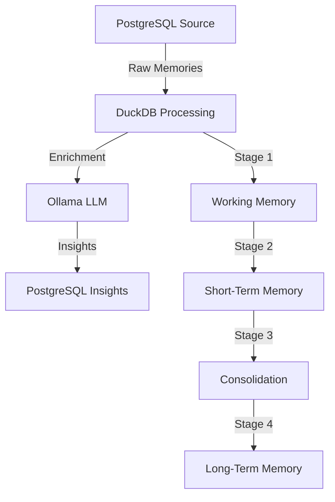

# Codex Dreams 🧠

[](https://www.gnu.org/licenses/gpl-3.0)
[](https://www.python.org/downloads/)
[](https://www.getdbt.com/)

A biologically-inspired memory management system that models human cognitive processes through hierarchical episodic memory, spatial representations, and Hebbian consolidation patterns.

## 🌟 Overview

Codex Dreams implements a sophisticated memory pipeline that simulates biological memory systems, processing memories through stages that mirror human cognitive processes. Built with DuckDB, dbt Core, and Ollama LLM integration, it provides a unique approach to memory management and insight generation.

### Key Features

- **🧬 Biological Memory Modeling**: Implements working memory capacity limits (Miller's 7±2), hippocampal consolidation, and cortical semantic networks
- **🔄 Multi-Stage Processing**: Four-stage pipeline from working memory through long-term storage
- **🤖 AI-Powered Insights**: Ollama LLM integration for semantic extraction and insight generation
- **⚡ Real-Time Processing**: Continuous memory ingestion with configurable biological rhythms
- **🛠️ Cross-Platform Service**: Daemon service with CLI interface for Windows, macOS, and Linux
- **📊 Performance Optimized**: Incremental processing with DuckDB analytical engine

## 🏗️ Architecture



### Memory Processing Stages

1. **Working Memory** (30-second window)
   - Attention window with 7±2 item capacity
   - LLM enrichment for entity/topic extraction
   - Emotional salience calculation

2. **Short-Term Memory** (30-minute buffer)
   - Hierarchical episode construction
   - Goal-task-action decomposition
   - Spatial memory representations

3. **Memory Consolidation** (Hourly)
   - Hippocampal replay simulation
   - Hebbian learning patterns
   - Synaptic strengthening/weakening

4. **Long-Term Memory** (Permanent)
   - Semantic network organization
   - Cortical column mapping
   - Retrieval mechanism implementation

## 🚀 Quick Start

### Prerequisites

- Python 3.8+
- PostgreSQL database (local or remote)
- Ollama server with models:
  - `qwen2.5:0.5b` (local development - available)
  - `llama2` or `mistral` (production alternatives)
  - Note: Some models in .env.example may not be available in Ollama

### Installation

```bash
# Clone the repository
git clone https://github.com/Ladvien/codex-dreams.git
cd codex-dreams

# Install the package
pip install -e .

# Configure environment
cp .env.example .env
# Edit .env with your database and Ollama server details
```

### Basic Usage

```bash
# Initialize the service
codex init

# Start the background service
codex start

# Check service status
codex status

# View logs
codex logs

# Run a one-time insight generation
codex run

# Stop the service
codex stop
```

## ⚙️ Configuration

### Environment Variables

Create a `.env` file with:

```bash
# Database Configuration
POSTGRES_DB_URL=postgresql://username@localhost:5432/codex_db  # or 'codex' to match .env.example
DUCKDB_PATH=/Users/ladvien/biological_memory/dbs/memory.duckdb

# Ollama Configuration
OLLAMA_URL=http://localhost:11434  # .env.example uses 192.168.1.110:11434
OLLAMA_MODEL=qwen2.5:0.5b  # .env.example has gpt-oss:20b (not available)
EMBEDDING_MODEL=nomic-embed-text

# Additional Configuration
MAX_DB_CONNECTIONS=160
DBT_PROFILES_DIR=/Users/ladvien/.dbt
DBT_PROJECT_DIR=/Users/ladvien/codex-dreams/biological_memory
OLLAMA_TIMEOUT=300
```

**Note**: Biological parameters are configured in `biological_memory/dbt_project.yml`, not as environment variables.

### Interactive Configuration

```bash
# Open interactive configuration editor
codex config

# Switch between environments
codex env local
codex env production
```

## 🧪 Development

### Project Structure

```
codex-dreams/
├── src/                    # Python source code
│   ├── generate_insights.py
│   ├── codex_cli.py
│   ├── codex_service.py
│   └── codex_scheduler.py
├── biological_memory/      # dbt project
│   ├── models/            # SQL transformations
│   ├── macros/            # Reusable SQL functions
│   └── tests/             # dbt tests
├── tests/                 # Python tests
├── docs/                  # Documentation
└── sql/                   # Database setup scripts
```

### Running Tests

```bash
# Set up environment first
source .env

# Run all tests
pytest tests/ -v

# Run with coverage (Note: May have issues with concurrent tests)
pytest tests/ --cov=src --cov-report=term-missing --tb=short

# Run dbt tests (requires OLLAMA_URL environment variable)
dbt test
```

### Building dbt Models

```bash
# Run all models (no need to cd into biological_memory)
dbt run

# Run specific stage
dbt run --select stage:working_memory
dbt run --select stage:consolidation

# Generate documentation
dbt docs generate
dbt docs serve
```

**Note**: Ensure environment variables are set before running dbt commands.

## 📊 Monitoring

### Service Health

```bash
# Check service status
codex status

# View recent logs
codex logs --lines 100

# Note: 'codex stats' command does not exist - use 'codex status' instead
```

### Database Monitoring

The system includes built-in monitoring views:
- `memory_dashboard`: Overall memory system analytics
- `memory_health`: System health metrics and alerts
- Biological parameter monitoring via dbt macros

## 🔬 Biological Parameters

Key configurable parameters that control memory processing:

| Parameter | Default | Description | Location |
|-----------|---------|-------------|----------|
| `working_memory_capacity` | 7 | Miller's magic number (7±2) | dbt_project.yml |
| `short_term_memory_duration` | 30 | STM duration in seconds | dbt_project.yml |
| `consolidation_threshold` | 0.6 | Minimum strength for consolidation | dbt_project.yml |
| `hebbian_learning_rate` | 0.1 | Synaptic strengthening rate | dbt_project.yml |
| `gradual_forgetting_rate` | 0.9 | Memory retention factor | dbt_project.yml |
| `replay_frequency`* | 90 min | Consolidation replay interval | Architecture docs |

*Note: replay_frequency is a conceptual parameter documented in architecture but not yet configurable in dbt_project.yml

## ⚠️ Known Issues & Requirements

### Configuration Requirements
- **Environment Variables**: Many commands require setting environment variables first (`source .env`)
- **Ollama Models**: Some models in configuration may not be available - use `ollama list` to check
- **Database Names**: Ensure consistency between `codex` and `codex_db` in configurations

### Known Issues
- **Test Coverage**: Running coverage with `--cov` may cause crashes with concurrent database tests
- **High Test Failure Rate**: Many tests require specific environment setup to pass
- **Missing CLI Commands**: `codex stats` doesn't exist - use `codex status` instead
- **Biological Parameters**: Located in `dbt_project.yml`, not environment variables

## 🛡️ Security

- Database credentials stored in environment variables
- No hardcoded secrets in codebase
- SQL injection protection via parameterized queries
- Connection pooling with configurable limits

## 📚 Documentation

- [Architecture Overview](docs/architecture/ARCHITECTURE.md) - Detailed technical architecture
- [Daemon Setup](docs/DAEMON_README.md) - Cross-platform service configuration
- [API Reference](docs/api/) - Component API documentation
- [Biological Models](docs/bmps/) - Memory model specifications

## 🤝 Contributing

Contributions are welcome! Please read our contributing guidelines and submit pull requests to the `main` branch.

### Development Workflow

1. Fork the repository
2. Create a feature branch (`git checkout -b feature/amazing-feature`)
3. Commit your changes (`git commit -m 'Add amazing feature'`)
4. Push to the branch (`git push origin feature/amazing-feature`)
5. Open a Pull Request

## 📄 License

This project is licensed under the GNU General Public License v3.0 - see the [LICENSE](LICENSE) file for details.

## 🙏 Acknowledgments

- Inspired by neuroscience research on human memory systems
- Built with [dbt Core](https://www.getdbt.com/) for data transformations
- Powered by [DuckDB](https://duckdb.org/) analytical database
- AI capabilities via [Ollama](https://ollama.ai/) local LLM server

## 📞 Support

- **Issues**: [GitHub Issues](https://github.com/Ladvien/codex-dreams/issues)
- **Discussions**: [GitHub Discussions](https://github.com/Ladvien/codex-dreams/discussions)
- **Documentation**: [Wiki](https://github.com/Ladvien/codex-dreams/wiki)

---

*"Memory is the treasury and guardian of all things." - Cicero*