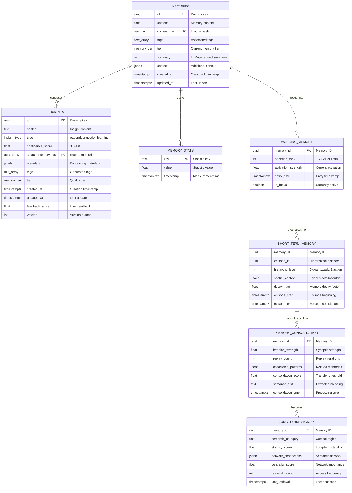
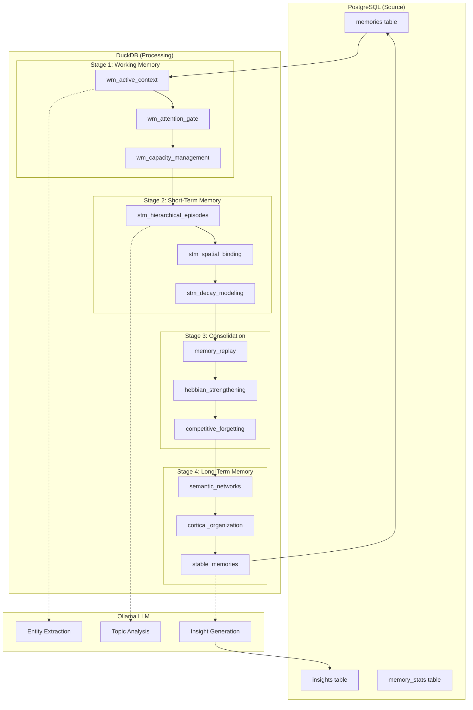

# Data Model & Entity Relationship Documentation

## Overview

The Codex Dreams biological memory system implements a sophisticated data pipeline that models human cognitive memory processes through a PostgreSQL → DuckDB → PostgreSQL architecture.

## Entity Relationship Diagram



## Data Flow Architecture



## Table Purposes & Biological Mapping

### PostgreSQL Tables (Persistent Storage)

#### `memories`
- **Purpose**: Primary storage for all memory records
- **Biological Analog**: Hippocampal memory traces
- **Key Features**:
  - Unique content hashing prevents duplicates
  - Tier system tracks memory progression
  - Tags enable semantic categorization
  - Timestamps track temporal dynamics

#### `insights`
- **Purpose**: Stores generated insights from memory processing
- **Biological Analog**: Prefrontal cortex abstractions
- **Key Features**:
  - Links to source memories via foreign keys
  - Confidence scoring for quality assessment
  - Metadata preserves processing context
  - Version tracking for insight evolution

#### `memory_stats`
- **Purpose**: System health and performance metrics
- **Biological Analog**: Homeostatic monitoring
- **Key Features**:
  - Real-time performance tracking
  - Memory system health indicators
  - Processing throughput metrics

### DuckDB Processing Stages

#### Stage 1: Working Memory Models
- **Purpose**: Implements attention and capacity limits
- **Biological Analog**: Prefrontal cortex working memory
- **Key Models**:
  - `wm_active_context`: Current attention focus
  - `wm_attention_gate`: Filtering mechanism
  - `wm_capacity_management`: Miller's 7±2 enforcement

#### Stage 2: Short-Term Memory Models
- **Purpose**: Hierarchical episode construction
- **Biological Analog**: Hippocampal episodic binding
- **Key Models**:
  - `stm_hierarchical_episodes`: Goal-task-action decomposition
  - `stm_spatial_binding`: Egocentric/allocentric representations
  - `stm_decay_modeling`: Temporal decay functions

#### Stage 3: Consolidation Models
- **Purpose**: Memory strengthening and transfer
- **Biological Analog**: Sleep-dependent consolidation
- **Key Models**:
  - `memory_replay`: Hippocampal replay simulation
  - `hebbian_strengthening`: Synaptic plasticity
  - `competitive_forgetting`: Weak memory elimination

#### Stage 4: Long-Term Memory Models
- **Purpose**: Semantic organization and retrieval
- **Biological Analog**: Cortical memory storage
- **Key Models**:
  - `semantic_networks`: Conceptual relationships
  - `cortical_organization`: Regional categorization
  - `stable_memories`: Permanent storage

## Key Relationships

### Memory Progression
```
memories → working_memory → short_term_memory → consolidation → long_term_memory
```

### Insight Generation
```
memories + consolidation → Ollama LLM → insights
```

### Biological Parameters
- **Working Memory Capacity**: 7±2 items (Miller's Law)
- **Short-Term Duration**: 30 seconds
- **Consolidation Threshold**: 0.6 strength
- **Hebbian Learning Rate**: 0.1
- **Forgetting Rate**: 0.05

## Data Integrity & Constraints

### Primary Keys
- All tables use UUID primary keys for distributed compatibility
- Content hashing provides natural unique constraints

### Foreign Key Relationships
- `insights.source_memory_ids[]` → `memories.id`
- All processing stages reference `memories.id`

### Cascading Operations
- Memory deletion cascades through all processing stages
- Insight generation preserves source memory references

## Performance Considerations

### Indexes
- GIN indexes on array columns (tags, source_memory_ids)
- B-tree indexes on timestamps for temporal queries
- Hash indexes on content_hash for duplicate detection

### Materialization Strategy
- Working memory: Ephemeral (real-time)
- Short-term memory: Views (dynamic)
- Consolidation: Incremental tables (efficient updates)
- Long-term memory: Tables (persistent)

## Missing Components (Identified Gaps)

1. **User Feedback Loop**: No mechanism to incorporate user ratings
2. **Memory Retrieval API**: No documented query interface
3. **Conflict Resolution**: No handling for contradictory memories
4. **Privacy Controls**: No PII detection or redaction
5. **Multi-User Support**: Single-user system currently

## Recommendations

### Immediate Priority
1. Create visual ERD diagrams in documentation
2. Add API documentation for memory operations
3. Implement user feedback mechanisms

### Future Enhancements
1. Add memory conflict resolution
2. Implement privacy controls
3. Design multi-user architecture
4. Add memory export/import capabilities

---

*Generated: 2025-08-30*
*Status: Initial documentation - requires validation with implementation*