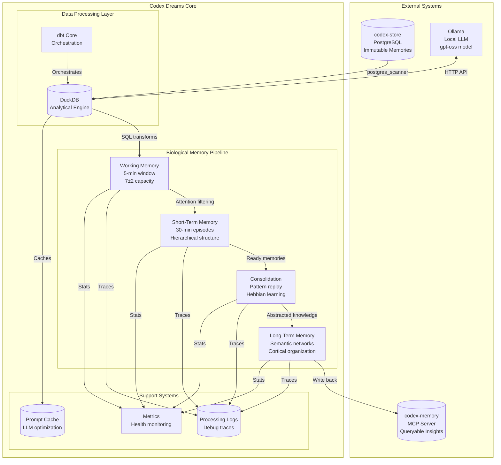

# Codex Dreams: A Biologically-Inspired Memory Consolidation Architecture

## Table of Contents

1. [Introduction & System Overview](#introduction--system-overview)
2. [Biological Foundations](#biological-foundations)
3. [System Architecture](#system-architecture)
4. [Technical Implementation](#technical-implementation)
5. [Memory Processing Pipeline](#memory-processing-pipeline)
6. [Monitoring & Observability](#monitoring--observability)
7. [Operational Procedures](#operational-procedures)
8. [Testing & Validation](#testing--validation)
9. [Performance Considerations](#performance-considerations)
10. [Migration Strategy](#migration-strategy)
11. [Future Extensions](#future-extensions)

## Introduction & System Overview

### What is Codex Dreams?

Codex Dreams is a background service that transforms raw text memories into rich, queryable insights by mimicking the human brain's memory consolidation process. Think of it as the unconscious processing that happens when you sleep - taking the day's experiences and turning them into lasting knowledge.

The system sits between two other components in your personal knowledge management ecosystem:

```
[codex-store] → [codex-dreams] → [codex-memory]
    (raw)        (processing)      (insights)
```

Just as your brain doesn't remember every detail of every moment, but instead extracts patterns, lessons, and connections, Codex Dreams processes raw text to discover the valuable insights within.

### Core Design Philosophy

The architecture follows three fundamental principles:

**Biological Fidelity**: Every processing stage maps to a specific brain function. When we limit working memory to 7±2 items, we're not arbitrarily constraining the system - we're modeling the actual capacity limits of human attention. This isn't just metaphorical; the constraints and processes mirror neuroscience research.

**Fail-Safe Processing**: Memories are immutable in codex-store, so we can always reprocess if needed. Each stage is idempotent - running it multiple times with the same input produces the same result. This means we can safely retry failed operations without corrupting data.

**Progressive Enhancement**: The system starts with a simple MVP that provides immediate value, then layers on biological complexity. You can begin extracting basic insights within days, while the full biological system develops over time.

### System Components Overview

Let me walk you through how a memory flows through the system:

1. **Input**: A user saves text to codex-store (perhaps notes from a meeting, thoughts about a project, or observations about their day)
2. **Attention**: Working Memory selects the most important recent memories to process
3. **Organization**: Short-Term Memory structures these into meaningful episodes
4. **Learning**: Consolidation discovers patterns across related memories
5. **Knowledge**: Long-Term Memory stores abstract principles and connections
6. **Retrieval**: codex-memory can query these insights for AI assistants

## Biological Foundations

### Understanding Memory Through Neuroscience

Before diving into technical details, let's understand the biological systems we're modeling. The human memory system isn't a simple storage device - it's a complex, multi-stage processor that actively transforms experiences into knowledge.

#### The Four-Stage Memory Model

**Working Memory (Prefrontal Cortex)**  
Imagine you're in a conversation. You can only actively think about a few things at once - maybe the point you're making, what the other person just said, and what you want to say next. This limitation isn't a bug; it's a feature. By constraining attention, working memory forces us to focus on what matters most.

In the brain, the prefrontal cortex maintains this temporary workspace. Neurons here show sustained firing during the delay period of working memory tasks, literally holding information "online" through persistent activity. The famous limit of 7±2 items comes from George Miller's research showing that people can typically hold between 5 and 9 chunks of information in mind at once.

**Short-Term Memory (Hippocampus)**  
When something stays in working memory long enough, it transfers to the hippocampus for short-term storage. Here, the brain begins organizing isolated moments into coherent episodes. The hippocampus contains several specialized cell types:

- **Place cells** fire when you're in specific locations
- **Time cells** track when events occur in a sequence  
- **Grid cells** create a coordinate system for spatial navigation
- **Social place cells** respond to the positions of other individuals

Together, these create rich episodic memories that capture not just what happened, but where, when, and with whom.

**Memory Consolidation (Hippocampal-Neocortical Dialog)**  
During rest and especially during sleep, the hippocampus "replays" recent memories in compressed bursts called sharp-wave ripples. These rapid replays, happening in just 100-200 milliseconds, reactivate the same neural patterns from the original experience.

Each replay strengthens connections between neurons that fired together (Hebbian learning: "neurons that fire together, wire together"). Over many replays, the neocortex gradually extracts statistical regularities - the patterns that appear across multiple experiences.

**Long-Term Memory (Neocortex)**  
Eventually, memories become independent of the hippocampus and reside in the neocortex. Here they're stored not as specific episodes but as semantic knowledge - abstract facts, concepts, and principles divorced from their original context.

The neocortex organizes information in a hierarchical, distributed manner across different regions:
- **Sensory cortices** store perceptual features
- **Motor cortex** stores action patterns
- **Association areas** store abstract concepts
- **Prefrontal cortex** stores executive strategies

### Why Model Biology?

You might wonder: why not just use a simpler approach? The answer lies in billions of years of evolution. The brain's memory system solves several hard problems:

1. **Relevance Filtering**: Not everything deserves to be remembered
2. **Pattern Discovery**: Individual experiences must yield general principles  
3. **Efficient Storage**: Similar memories share representations
4. **Graceful Forgetting**: Old, unused information fades to make room
5. **Integration**: New knowledge connects with existing understanding

By modeling these biological processes, we inherit solutions to these same challenges in our digital memory system.

## System Architecture

### High-Level Architecture

Let me show you how the biological model translates into a technical architecture:



### Data Flow Architecture

Understanding how data flows through the system is crucial. Let me trace a memory's journey:

#### Stage 1: Ingestion
When a new memory arrives in codex-store, it contains:
- Raw text content (the actual notes, thoughts, or observations)
- Context (what prompted this memory)
- Metadata (when created, any tags)
- Content hash (for deduplication)

#### Stage 2: Working Memory Selection
Every minute during waking hours (6 AM - 10 PM), the system:
1. Queries the last 5 minutes of memories
2. Enriches each with cognitive features via LLM
3. Calculates attention priority
4. Selects only the top 7±2 for processing

#### Stage 3: Short-Term Episode Formation
Selected memories are:
1. Analyzed for hierarchical structure (goals → tasks → actions)
2. Enhanced with spatial and temporal context
3. Grouped with related recent memories
4. Marked for consolidation when patterns emerge

#### Stage 4: Consolidation and Pattern Discovery
During consolidation:
1. Related memories are replayed together
2. Common patterns are extracted
3. Abstract principles are identified
4. Contradictions are noted
5. Semantic representations are generated

#### Stage 5: Long-Term Storage
Finally, consolidated memories are:
1. Stripped of episodic details
2. Organized into semantic categories
3. Connected to existing knowledge
4. Indexed for efficient retrieval

### Technology Stack Deep Dive

Let me explain why each technology was chosen and how they work together:

**PostgreSQL** serves as our permanent storage. Its ACID guarantees ensure we never lose raw memories, while its foreign data wrapper support enables DuckDB integration. The immutability of memories in codex-store means we can always reprocess if our algorithms improve.

**DuckDB** is our analytical workhorse. Unlike traditional databases optimized for transactions, DuckDB excels at the kind of bulk processing we need. Its columnar storage means we can scan millions of memories quickly. The built-in `prompt()` function provides seamless LLM integration:

```sql
-- DuckDB's prompt() function handles all the HTTP complexity
SELECT prompt(
    'Extract key insight from: ' || content,
    model := 'ollama',
    base_url := 'http://localhost:11434',
    model_name := 'gpt-oss'
) as insight
FROM memories;
```

**dbt Core** transforms our complex pipeline into manageable pieces. Each biological stage becomes a dbt model with clear dependencies. This gives us:
- Automatic dependency resolution
- Built-in testing framework
- Incremental processing
- Clear documentation

**Ollama** provides local LLM inference. Running models locally ensures privacy (your memories never leave your machine) and eliminates API costs. The gpt-oss model provides a good balance of capability and speed.

## Technical Implementation

### Database Schema Design

Let me walk through each schema, explaining not just what fields exist, but why they're structured this way.

#### Source Schema (PostgreSQL - codex-store)

```sql
-- This is our source of truth - managed by codex-store
-- We only read from this table, never modify
CREATE TABLE memories (
    -- Identity
    id UUID PRIMARY KEY DEFAULT gen_random_uuid(),
    
    -- Content
    content TEXT NOT NULL,  -- The actual memory text
    content_hash VARCHAR(64) NOT NULL,  -- For deduplication
    
    -- Context fields help understand why this was saved
    context_fingerprint VARCHAR(64) NOT NULL,
    context TEXT NOT NULL,  -- What prompted this memory
    summary TEXT NOT NULL,  -- Quick overview
    
    -- Organization
    metadata JSONB DEFAULT '{}',  -- Flexible additional data
    tags TEXT[] DEFAULT '{}',     -- User-defined categories
    
    -- For multi-part memories (like long articles)
    chunk_index INTEGER DEFAULT NULL,
    total_chunks INTEGER DEFAULT NULL,
    parent_id UUID DEFAULT NULL,
    
    -- Temporal tracking
    created_at TIMESTAMPTZ DEFAULT NOW(),
    updated_at TIMESTAMPTZ DEFAULT NOW()
);

-- Index for efficient incremental processing
CREATE INDEX idx_memories_created_at ON memories(created_at);
CREATE INDEX idx_memories_content_hash ON memories(content_hash);
```

#### Working Memory Schema (DuckDB)

```sql
-- Represents our attention window - what we're actively thinking about
CREATE SCHEMA staging;

-- Tracks processing state for reliability
CREATE TABLE staging.processing_state (
    memory_id UUID PRIMARY KEY,
    first_seen_at TIMESTAMP,      -- When we first noticed this memory
    processing_status VARCHAR(20), -- 'pending', 'processing', 'completed', 'failed'
    attempt_count INTEGER DEFAULT 0,
    last_attempt_at TIMESTAMP,
    error_message TEXT,           -- For debugging failures
    completed_at TIMESTAMP
);

-- Working memory buffer - our "conscious attention"
CREATE TABLE staging.working_memory_buffer (
    -- Core identity
    memory_id UUID PRIMARY KEY,
    content TEXT NOT NULL,
    created_at TIMESTAMP,
    
    -- Cognitive enrichment from LLM
    cognitive_features JSON,  -- Full LLM response
    
    -- Attention mechanics
    attention_priority FLOAT,  -- Combined importance score
    recency_weight FLOAT,      -- Exponential decay
    wm_slot INTEGER,          -- Position in attention (1-9)
    
    -- Extracted features for filtering
    importance_score FLOAT,
    urgency_score FLOAT,
    emotional_salience FLOAT,
    sentiment VARCHAR(20),
    task_type VARCHAR(50),
    
    -- When this entered working memory
    entered_wm_at TIMESTAMP DEFAULT CURRENT_TIMESTAMP
);

-- Efficient lookup of what's currently in attention
CREATE INDEX idx_wm_attention ON staging.working_memory_buffer(wm_slot);
CREATE INDEX idx_wm_priority ON staging.working_memory_buffer(attention_priority DESC);
```

#### Short-Term Memory Schema (DuckDB)

```sql
CREATE SCHEMA biological_memory;

-- Episodic buffer - organizing experiences into meaningful chunks
CREATE TABLE biological_memory.episodic_buffer (
    -- Identity
    id UUID PRIMARY KEY,
    original_content TEXT NOT NULL,
    
    -- Hierarchical organization (like how we structure experiences)
    level_0_goal TEXT,        -- "Learn Spanish"
    level_1_tasks TEXT[],     -- ["Study vocabulary", "Practice speaking"]
    atomic_actions TEXT[],    -- ["Reviewed 20 words", "Had 10-min conversation"]
    
    -- Contextual embedding (where/when/who)
    spatial_context JSON,     -- Location information
    temporal_context JSON,    -- Time relationships
    social_context JSON,      -- People involved
    phantom_objects JSON,     -- Objects and affordances
    
    -- Causal understanding
    temporal_marker TEXT,     -- "before lunch", "after meeting"
    causal_links TEXT[],      -- ["led to insight X", "caused by Y"]
    
    -- Memory dynamics
    stm_strength FLOAT,       -- How strong this memory is
    hebbian_potential INTEGER,-- Co-activation count
    consolidation_priority FLOAT,
    ready_for_consolidation BOOLEAN DEFAULT FALSE,
    
    -- Tracking
    entered_wm_at TIMESTAMP,
    entered_stm_at TIMESTAMP DEFAULT CURRENT_TIMESTAMP,
    wm_duration_seconds INTEGER
);

-- Indexes for consolidation selection
CREATE INDEX idx_stm_ready ON biological_memory.episodic_buffer(ready_for_consolidation) 
WHERE ready_for_consolidation = TRUE;
CREATE INDEX idx_stm_strength ON biological_memory.episodic_buffer(stm_strength DESC);
```

#### Consolidation Schema (DuckDB)

```sql
-- Memory replay buffer - where we discover patterns
CREATE TABLE biological_memory.consolidation_buffer (
    -- Identity
    id UUID PRIMARY KEY,
    
    -- Source episode
    original_content TEXT,
    level_0_goal TEXT,
    level_1_tasks TEXT[],
    
    -- Discovered patterns through replay
    discovered_patterns TEXT[],    -- Recurring themes
    synthesized_insights TEXT[],   -- New understanding
    predictive_patterns TEXT[],    -- If-then rules
    abstract_principles TEXT[],    -- General truths
    contradictions TEXT[],         -- Exceptions noted
    
    -- Association network
    associated_memory_ids UUID[],  -- Related memories
    association_strengths FLOAT[], -- How related
    total_association_strength FLOAT,
    
    -- Semantic transformation
    semantic_gist TEXT,           -- Abstract summary
    semantic_category TEXT,       -- Knowledge domain
    cortical_region TEXT,         -- Where to store
    knowledge_type TEXT,          -- Procedural/declarative
    abstraction_level INTEGER,    -- 1=concrete, 5=abstract
    
    -- Memory strength
    pre_consolidation_strength FLOAT,
    consolidated_strength FLOAT,
    
    -- Temporal tracking
    entered_stm_at TIMESTAMP,
    consolidated_at TIMESTAMP DEFAULT CURRENT_TIMESTAMP,
    consolidation_duration_ms INTEGER
);
```

#### Long-Term Memory Schema (PostgreSQL - target)

```sql
-- This is what gets written back for codex-memory to query
CREATE SCHEMA codex_processed;

-- Long-term semantic memory - the final knowledge store
CREATE TABLE codex_processed.semantic_memory (
    -- Identity
    id UUID PRIMARY KEY DEFAULT gen_random_uuid(),
    source_memory_id UUID NOT NULL,  -- Link to original
    
    -- Semantic content (what we learned)
    semantic_gist TEXT NOT NULL,     -- Core insight
    knowledge_type VARCHAR(50),      -- procedural/declarative/conditional
    abstraction_level INTEGER,       -- How abstract (1-5)
    confidence_score FLOAT,          -- How certain we are
    
    -- Categorization
    semantic_category VARCHAR(100),  -- Domain of knowledge
    cortical_region VARCHAR(50),     -- Metaphorical brain region
    
    -- Discovered knowledge
    patterns TEXT[],                 -- Recurring patterns found
    insights TEXT[],                 -- Key insights extracted
    predictions TEXT[],              -- Predictive rules learned
    principles TEXT[],               -- Abstract principles
    contradictions TEXT[],           -- Noted exceptions
    
    -- Knowledge graph connections
    related_concepts TEXT[],         -- Connected ideas
    integration_points TEXT[],       -- How this connects to existing knowledge
    
    -- Retrieval optimization
    retrieval_strength FLOAT,        -- How easily recalled
    access_count INTEGER DEFAULT 0,  -- Times retrieved
    last_accessed_at TIMESTAMP,
    
    -- Metadata
    processing_version VARCHAR(20),  -- Algorithm version
    created_at TIMESTAMP DEFAULT NOW(),
    
    -- Full-text search
    search_vector tsvector GENERATED ALWAYS AS (
        to_tsvector('english', 
            semantic_gist || ' ' || 
            COALESCE(array_to_string(patterns, ' '), '') || ' ' ||
            COALESCE(array_to_string(insights, ' '), '')
        )
    ) STORED
);

-- Indexes for efficient retrieval
CREATE INDEX idx_semantic_search ON codex_processed.semantic_memory USING GIN(search_vector);
CREATE INDEX idx_semantic_category ON codex_processed.semantic_memory(semantic_category);
CREATE INDEX idx_semantic_strength ON codex_processed.semantic_memory(retrieval_strength DESC);
CREATE INDEX idx_semantic_accessed ON codex_processed.semantic_memory(last_accessed_at DESC);

-- The simplified MVP view that codex-memory initially uses
CREATE TABLE codex_processed.insights (
    id UUID PRIMARY KEY DEFAULT gen_random_uuid(),
    memory_id UUID NOT NULL UNIQUE,
    
    -- Simple insight
    key_insight TEXT NOT NULL,
    insight_type VARCHAR(50) CHECK (insight_type IN ('observation', 'pattern', 'question', 'idea')),
    confidence_score FLOAT CHECK (confidence_score BETWEEN 0 AND 1),
    
    -- Basic entities
    people TEXT[] DEFAULT '{}',
    concepts TEXT[] DEFAULT '{}', 
    tools TEXT[] DEFAULT '{}',
    locations TEXT[] DEFAULT '{}',
    
    -- Metadata
    extraction_model VARCHAR(100),
    extraction_timestamp TIMESTAMPTZ,
    processing_duration_ms INTEGER,
    created_at TIMESTAMPTZ DEFAULT NOW()
);
```

### dbt Models Implementation

Now let's implement the actual transformation logic. I'll walk through each model, explaining the biological reasoning behind the SQL.

#### Project Structure

```yaml
# dbt_project.yml
name: 'codex_dreams'
version: '1.0.0'
profile: 'codex_dreams'

# Model-specific configurations
models:
  codex_dreams:
    # MVP models for immediate value
    staging:
      +materialized: view
      +schema: staging
    
    intermediate:
      +materialized: view  
      +schema: intermediate
      
    marts:
      +materialized: table
      +schema: marts
      +tags: ['mvp']
      
    # Biological models
    biological:
      working_memory:
        +materialized: view  # Always fresh
        +tags: ['continuous', 'biological']
        
      short_term:
        +materialized: incremental
        +unique_key: id
        +on_schema_change: sync_all_columns
        +tags: ['short_term', 'biological']
        
      consolidation:
        +materialized: incremental
        +unique_key: id
        +tags: ['consolidation', 'biological']
        
      long_term:
        +materialized: table
        +indexes:
          - columns: ['semantic_category']
          - columns: ['retrieval_strength']
        +tags: ['long_term', 'biological']

# Global variables
vars:
  # Ollama configuration
  ollama_url: "{{ env_var('OLLAMA_URL', 'http://localhost:11434') }}"
  ollama_model: "gpt-oss"
  ollama_temperature: 0.3
  ollama_timeout_ms: 30000
  
  # Processing parameters
  batch_size: 100
  max_retry_attempts: 3
  
  # Biological parameters
  working_memory_capacity: 7
  working_memory_window_minutes: 5
  stm_duration_minutes: 30
  consolidation_threshold: 0.5
  hebbian_learning_rate: 0.1
  forgetting_rate: 0.95
  
  # Quality thresholds
  min_confidence_score: 0.3
  min_content_length: 100
  max_content_length: 50000
```

#### Working Memory Model

```sql
-- models/biological/working_memory/wm_active_attention.sql
{{
    config(
        materialized='view',
        tags=['continuous', 'biological']
    )
}}

WITH recent_memories AS (
    -- Get memories from the last 5 minutes (our attention window)
    SELECT 
        m.id,
        m.content,
        m.created_at,
        m.context,
        m.summary,
        m.metadata,
        -- Calculate age in seconds for decay calculation
        EXTRACT(EPOCH FROM (CURRENT_TIMESTAMP - m.created_at)) as age_seconds
    FROM {{ source('codex_store', 'memories') }} m
    LEFT JOIN {{ source('staging', 'processing_state') }} ps
        ON m.id = ps.memory_id
    WHERE 
        -- Only memories within our attention window
        m.created_at > CURRENT_TIMESTAMP - INTERVAL '{{ var("working_memory_window_minutes") }} minutes'
        -- Skip if already processed successfully
        AND (ps.processing_status IS NULL OR ps.processing_status != 'completed')
        -- Content length sanity check
        AND LENGTH(m.content) BETWEEN {{ var('min_content_length') }} AND {{ var('max_content_length') }}
),

cognitive_enrichment AS (
    SELECT 
        *,
        -- Use Ollama to extract cognitive features
        -- This mimics how the prefrontal cortex evaluates importance
        prompt(
            'Analyze this text for cognitive processing. Extract: ' ||
            '1) Key entities (people, organizations, tools), ' ||
            '2) Importance (0-1), urgency (0-1), emotional weight (0-1), ' ||
            '3) Task type (goal/task/action/observation), ' ||
            '4) Sentiment (positive/neutral/negative). ' ||
            'Return JSON only. Text: ' || content,
            model := 'ollama',
            base_url := '{{ var("ollama_url") }}',
            model_name := '{{ var("ollama_model") }}',
            temperature := {{ var("ollama_temperature") }}
        ) as cognitive_features,
        
        -- Exponential decay mimics how recent items stay in attention
        EXP(-age_seconds / 300.0) as recency_weight  -- 5-minute half-life
        
    FROM recent_memories
),

attention_scoring AS (
    SELECT 
        *,
        -- Safely extract scores with defaults
        COALESCE(
            TRY_CAST(json_extract_string(cognitive_features, '$.importance') AS FLOAT),
            0.5
        ) as importance_score,
        
        COALESCE(
            TRY_CAST(json_extract_string(cognitive_features, '$.urgency') AS FLOAT),
            0.3
        ) as urgency_score,
        
        COALESCE(
            TRY_CAST(json_extract_string(cognitive_features, '$.emotional_weight') AS FLOAT),
            0.3
        ) as emotional_salience,
        
        COALESCE(
            json_extract_string(cognitive_features, '$.sentiment'),
            'neutral'
        ) as sentiment,
        
        COALESCE(
            json_extract_string(cognitive_features, '$.task_type'),
            'observation'
        ) as task_type
        
    FROM cognitive_enrichment
),

priority_calculation AS (
    SELECT 
        *,
        -- Combine factors like the brain weighs attention
        -- These weights come from attention research
        (
            importance_score * 0.4 +      -- What matters most
            urgency_score * 0.3 +         -- What needs action
            emotional_salience * 0.3      -- What we feel strongly about
        ) * recency_weight as attention_priority
        
    FROM attention_scoring
),

capacity_limited AS (
    SELECT 
        *,
        -- Assign slots in working memory (1-9)
        ROW_NUMBER() OVER (
            ORDER BY attention_priority DESC
        ) as wm_slot,
        
        -- Add some biological variability to capacity
        -- Real working memory fluctuates with fatigue, mood, etc.
        {{ var('working_memory_capacity') }} + 
        FLOOR(RANDOM() * 3 - 1) as current_capacity
        
    FROM priority_calculation
)

-- Final selection: only memories that fit in working memory
SELECT 
    id as memory_id,
    content,
    created_at,
    context,
    summary,
    metadata,
    cognitive_features,
    importance_score,
    urgency_score,
    emotional_salience,
    sentiment,
    task_type,
    attention_priority,
    recency_weight,
    wm_slot,
    CURRENT_TIMESTAMP as entered_wm_at
FROM capacity_limited
WHERE wm_slot <= current_capacity  -- Enforce Miller's 7±2 limit
ORDER BY wm_slot
```

#### Short-Term Memory Model

```sql
-- models/biological/short_term/stm_episode_formation.sql
{{
    config(
        materialized='incremental',
        unique_key='memory_id',
        on_schema_change='sync_all_columns',
        tags=['short_term', 'biological']
    )
}}

WITH working_memories AS (
    -- Get memories that have been in working memory for a bit
    -- This mimics the transfer from prefrontal to hippocampus
    SELECT * FROM {{ ref('wm_active_attention') }}
    WHERE entered_wm_at < CURRENT_TIMESTAMP - INTERVAL '1 minute'
),


-- For incremental runs, only process new memories
filtered_memories AS (
    SELECT w.*
    FROM working_memories w
    WHERE NOT EXISTS (
        SELECT 1 FROM {{ this }} t
        WHERE t.memory_id = w.memory_id
    )
),

-- For full refresh, process everything
filtered_memories AS (
    SELECT * FROM working_memories
),


hierarchical_structuring AS (
    SELECT 
        *,
        -- Extract hierarchical episode structure
        -- This mimics how the hippocampus organizes experiences
        prompt(
            'Analyze this memory and identify its hierarchical structure. ' ||
            'Extract: 1) High-level goal being pursued, ' ||
            '2) Specific tasks to achieve the goal, ' ||
            '3) Concrete actions taken, ' ||
            '4) Temporal relationships (before/after/during what?), ' ||
            '5) Causal relationships (what led to what?). ' ||
            'Context: ' || COALESCE(context, 'none') || ' ' ||
            'Return as JSON. Memory: ' || content,
            model := 'ollama',
            base_url := '{{ var("ollama_url") }}',
            model_name := '{{ var("ollama_model") }}'
        ) as hierarchical_features
        
    FROM filtered_memories
),

spatial_temporal_encoding AS (
    SELECT 
        *,
        -- Extract spatial and temporal context
        -- Mimics hippocampal place cells and time cells
        prompt(
            'Extract spatial, temporal, and social context from this memory. ' ||
            'Include: 1) Physical location or virtual space, ' ||
            '2) Time of day and duration, ' ||
            '3) People present or mentioned, ' ||
            '4) Objects and their uses. ' ||
            'Return as JSON. Memory: ' || content,
            model := 'ollama',
            base_url := '{{ var("ollama_url") }}',
            model_name := '{{ var("ollama_model") }}'
        ) as contextual_features
        
    FROM hierarchical_structuring
),

episode_formation AS (
    SELECT 
        memory_id,
        content as original_content,
        created_at,
        metadata,
        
        -- Hierarchical structure
        json_extract_string(hierarchical_features, '$.goal') as level_0_goal,
        json_extract(hierarchical_features, '$.tasks') as level_1_tasks,
        json_extract(hierarchical_features, '$.actions') as atomic_actions,
        json_extract_string(hierarchical_features, '$.temporal_marker') as temporal_marker,
        json_extract(hierarchical_features, '$.causal_links') as causal_links,
        
        -- Contextual features
        json_extract(contextual_features, '$.spatial') as spatial_context,
        json_extract(contextual_features, '$.temporal') as temporal_context,
        json_extract(contextual_features, '$.social') as social_context,
        json_extract(contextual_features, '$.objects') as phantom_objects,
        
        -- Working memory features carried forward
        importance_score,
        urgency_score,
        emotional_salience,
        sentiment,
        task_type,
        attention_priority,
        entered_wm_at,
        
        -- Calculate STM strength (how well this will be remembered)
        attention_priority * 0.5 +  -- How much attention it got
        CASE 
            WHEN sentiment = 'positive' THEN 0.2
            WHEN sentiment = 'negative' THEN 0.15  
            ELSE 0.1
        END +
        emotional_salience * 0.2 as stm_strength,
        
        CURRENT_TIMESTAMP as entered_stm_at
        
    FROM spatial_temporal_encoding
),

hebbian_calculation AS (
    -- Calculate co-activation patterns (Hebbian learning)
    -- Memories about the same goal strengthen each other
    SELECT 
        e.*,
        
        -- Count how many related memories are active
        COUNT(*) OVER (
            PARTITION BY level_0_goal
            ORDER BY created_at
            RANGE BETWEEN INTERVAL '1 hour' PRECEDING AND CURRENT ROW
        ) as hebbian_potential,
        
        -- Consolidation priority based on multiple factors
        stm_strength * 0.4 +
        LOG(1 + COUNT(*) OVER (PARTITION BY level_0_goal)) * 0.3 +
        CASE 
            WHEN emotional_salience > 0.7 THEN 0.3
            ELSE emotional_salience * 0.3
        END as consolidation_priority
        
    FROM episode_formation e
)

SELECT 
    memory_id,
    original_content,
    created_at,
    metadata,
    level_0_goal,
    level_1_tasks,
    atomic_actions,
    temporal_marker,
    causal_links,
    spatial_context,
    temporal_context,
    social_context,
    phantom_objects,
    stm_strength,
    hebbian_potential,
    consolidation_priority,
    
    -- Ready for consolidation when:
    -- 1. Multiple related memories exist (Hebbian threshold)
    -- 2. OR emotional salience is very high (flashbulb memories)
    -- 3. OR it's been in STM long enough
    CASE
        WHEN hebbian_potential >= 3 AND consolidation_priority > 0.5 THEN TRUE
        WHEN emotional_salience > 0.8 THEN TRUE
        WHEN entered_stm_at < CURRENT_TIMESTAMP - INTERVAL '{{ var("stm_duration_minutes") }} minutes' THEN TRUE
        ELSE FALSE
    END as ready_for_consolidation,
    
    entered_wm_at,
    entered_stm_at,
    EXTRACT(EPOCH FROM (entered_stm_at - entered_wm_at)) as wm_duration_seconds
    
FROM hebbian_calculation
```

#### Memory Consolidation Model

```sql
-- models/biological/consolidation/memory_replay.sql
{{
    config(
        materialized='incremental',
        unique_key='memory_id',
        tags=['consolidation', 'biological'],
        pre_hook="SET memory_limit = '{{ var('duckdb_memory_limit', '8GB') }}'"
    )
}}

WITH ready_memories AS (
    -- Get memories ready for consolidation
    SELECT * FROM {{ ref('stm_episode_formation') }}
    WHERE ready_for_consolidation = TRUE
    
    AND memory_id NOT IN (SELECT memory_id FROM {{ this }})
    
),

-- Find related memories for replay
-- This mimics hippocampal sharp-wave ripples where related memories are replayed together
memory_associations AS (
    SELECT 
        r1.memory_id as source_id,
        r2.memory_id as target_id,
        r1.level_0_goal as source_goal,
        r2.level_0_goal as target_goal,
        
        -- Calculate association strength based on multiple factors
        CASE
            -- Same goal = strong connection (like neurons for the same concept)
            WHEN r1.level_0_goal = r2.level_0_goal THEN 0.8
            
            -- Overlapping tasks = medium connection
            WHEN ARRAY_LENGTH(
                list_intersect(r1.level_1_tasks, r2.level_1_tasks)
            ) > 0 THEN 0.5
            
            -- Temporal proximity = weak connection
            WHEN ABS(EXTRACT(EPOCH FROM (r1.created_at - r2.created_at))) < 3600 THEN 0.3
            
            -- Same location = contextual connection
            WHEN json_extract_string(r1.spatial_context, '$.location') = 
                 json_extract_string(r2.spatial_context, '$.location') THEN 0.4
                 
            ELSE 0.1
        END as association_strength
        
    FROM ready_memories r1
    -- Look for related memories in recent STM
    CROSS JOIN {{ ref('stm_episode_formation') }} r2
    WHERE r1.memory_id != r2.memory_id
    AND r2.created_at BETWEEN r1.created_at - INTERVAL '24 hours' 
                          AND r1.created_at + INTERVAL '24 hours'
),

-- Simulate replay cycles where patterns are discovered
replay_synthesis AS (
    SELECT 
        r.*,
        
        -- Aggregate related memories
        LIST(DISTINCT ma.target_id) as associated_memory_ids,
        LIST(ma.association_strength) as association_strengths,
        SUM(ma.association_strength) as total_association_strength,
        COUNT(DISTINCT ma.target_id) as associated_memory_count,
        
        -- Use LLM to discover patterns across replayed memories
        prompt(
            'Analyze these related memories for pattern discovery: ' ||
            'Primary memory: ' || r.original_content || ' ' ||
            'Goal: ' || r.level_0_goal || ' ' ||
            'This connects to ' || COUNT(DISTINCT ma.target_id) || ' related memories. ' ||
            'Extract: 1) Recurring patterns, 2) Key insights, ' ||
            '3) Predictive rules (if X then Y), 4) Contradictions, ' ||
            '5) Abstract principles. Return as JSON.',
            model := 'ollama',
            base_url := '{{ var("ollama_url") }}',
            model_name := '{{ var("ollama_model") }}'
        ) as pattern_extraction
        
    FROM ready_memories r
    LEFT JOIN memory_associations ma ON r.memory_id = ma.source_id
    GROUP BY r.memory_id, r.original_content, r.created_at, r.metadata,
             r.level_0_goal, r.level_1_tasks, r.atomic_actions,
             r.temporal_marker, r.causal_links, r.spatial_context,
             r.temporal_context, r.social_context, r.phantom_objects,
             r.stm_strength, r.hebbian_potential, r.consolidation_priority,
             r.entered_wm_at, r.entered_stm_at, r.wm_duration_seconds
),

-- Apply Hebbian learning and consolidation dynamics
consolidation_dynamics AS (
    SELECT 
        *,
        
        -- Extract discovered patterns
        json_extract(pattern_extraction, '$.patterns') as discovered_patterns,
        json_extract(pattern_extraction, '$.insights') as synthesized_insights,
        json_extract(pattern_extraction, '$.predictions') as predictive_patterns,
        json_extract(pattern_extraction, '$.principles') as abstract_principles,
        json_extract(pattern_extraction, '$.contradictions') as contradictions,
        
        -- Calculate consolidated strength
        -- Mimics synaptic strengthening through repeated activation
        stm_strength * 
        (1 + {{ var('hebbian_learning_rate') }} * associated_memory_count) *
        (1 + LOG(1 + total_association_strength)) as pre_consolidation_strength
        
    FROM replay_synthesis
),

-- Generate semantic representation for cortical storage
cortical_preparation AS (
    SELECT 
        *,
        
        -- Transform episodic memory to semantic memory
        -- This mimics the hippocampal-neocortical transfer
        prompt(
            'Create semantic summary for long-term storage: ' ||
            'Experience: ' || original_content || ' ' ||
            'Goal: ' || level_0_goal || ' ' ||
            'Patterns: ' || CAST(discovered_patterns AS TEXT) || ' ' ||
            'Insights: ' || CAST(synthesized_insights AS TEXT) || ' ' ||
            'Generate: 1) Abstract gist without episodic details, ' ||
            '2) Knowledge category, 3) Cortical region (sensory/motor/association/prefrontal), ' ||
            '4) Knowledge type (procedural/declarative/conditional), ' ||
            '5) How this connects to general knowledge. Return as JSON.',
            model := 'ollama',
            base_url := '{{ var("ollama_url") }}',
            model_name := '{{ var("ollama_model") }}'
        ) as semantic_transformation,
        
        -- Apply forgetting to weak memories
        CASE 
            WHEN pre_consolidation_strength < {{ var('consolidation_threshold') }} 
            THEN pre_consolidation_strength * {{ var('forgetting_rate') }}
            ELSE pre_consolidation_strength
        END as consolidated_strength
        
    FROM consolidation_dynamics
)

SELECT 
    memory_id,
    original_content,
    created_at,
    metadata,
    
    -- Episode structure
    level_0_goal,
    level_1_tasks,
    atomic_actions,
    temporal_marker,
    causal_links,
    
    -- Discovered knowledge
    discovered_patterns,
    synthesized_insights, 
    predictive_patterns,
    abstract_principles,
    contradictions,
    
    -- Associations
    associated_memory_ids,
    association_strengths,
    total_association_strength,
    
    -- Semantic representation
    json_extract_string(semantic_transformation, '$.gist') as semantic_gist,
    json_extract_string(semantic_transformation, '$.category') as semantic_category,
    json_extract_string(semantic_transformation, '$.cortical_region') as cortical_region,
    json_extract_string(semantic_transformation, '$.knowledge_type') as knowledge_type,
    json_extract(semantic_transformation, '$.connections') as integration_points,
    COALESCE(
        TRY_CAST(json_extract_string(semantic_transformation, '$.abstraction_level') AS INTEGER),
        3
    ) as abstraction_level,
    
    -- Memory dynamics
    pre_consolidation_strength,
    consolidated_strength,
    
    -- Temporal tracking
    entered_wm_at,
    entered_stm_at,
    CURRENT_TIMESTAMP as consolidated_at,
    EXTRACT(EPOCH FROM (CURRENT_TIMESTAMP - entered_stm_at))/3600 as stm_duration_hours
    
FROM cortical_preparation
WHERE consolidated_strength > {{ var('consolidation_threshold') }}
```

#### Long-Term Memory Model

```sql
-- models/biological/long_term/ltm_semantic_network.sql
{{
    config(
        materialized='table',
        tags=['long_term', 'biological'],
        post_hook=[
            "CREATE INDEX IF NOT EXISTS idx_ltm_semantic ON {{ this }} USING GIN(to_tsvector('english', semantic_gist))",
            "CREATE INDEX IF NOT EXISTS idx_ltm_patterns ON {{ this }} USING GIN(patterns)",
            "ANALYZE {{ this }}"
        ]
    )
}}

WITH consolidated_memories AS (
    SELECT * FROM {{ ref('memory_replay') }}
),

-- Build semantic similarity network
-- This mimics how the cortex organizes related concepts
semantic_clustering AS (
    SELECT 
        c.*,
        
        -- Hash into cortical columns (like real cortical organization)
        -- Related concepts map to nearby columns
        HASH(semantic_category || '::' || cortical_region) % 1000 as minicolumn_id,
        HASH(cortical_region) % 100 as macrocolumn_id,
        
        -- Within-column competition (winner-take-all dynamics)
        RANK() OVER (
            PARTITION BY semantic_category, cortical_region
            ORDER BY consolidated_strength DESC
        ) as column_rank,
        
        -- Count memories in this semantic category
        COUNT(*) OVER (
            PARTITION BY semantic_category
        ) as category_density
        
    FROM consolidated_memories c
),

-- Calculate retrieval dynamics based on memory principles
retrieval_dynamics AS (
    SELECT 
        *,
        
        -- Multi-factor retrieval strength calculation
        -- Based on: consolidation, recency, frequency, and importance
        (
            -- Base strength from consolidation
            consolidated_strength * 0.3 +
            
            -- Competition within cortical column
            (1.0 / SQRT(column_rank)) * 0.2 +
            
            -- Recency factor (forgetting curve)
            EXP(-EXTRACT(EPOCH FROM (CURRENT_TIMESTAMP - consolidated_at)) / (86400 * 30)) * 0.3 +
            
            -- Frequency factor (assuming access tracking would be added)
            LOG(2) * 0.2  -- Placeholder for access count
            
        ) as retrieval_strength,
        
        -- Categorize by age for forgetting curve analysis
        CASE 
            WHEN consolidated_at > CURRENT_TIMESTAMP - INTERVAL '1 day' THEN 'recent'
            WHEN consolidated_at > CURRENT_TIMESTAMP - INTERVAL '7 days' THEN 'week_old'
            WHEN consolidated_at > CURRENT_TIMESTAMP - INTERVAL '30 days' THEN 'month_old'
            ELSE 'remote'
        END as memory_age,
        
        -- Determine consolidation state
        CASE
            WHEN abstraction_level >= 4 THEN 'schematized'  -- Highly abstract
            WHEN associated_memory_ids IS NOT NULL AND ARRAY_LENGTH(associated_memory_ids, 1) > 5 THEN 'integrated'
            WHEN abstraction_level >= 3 THEN 'semantic'
            ELSE 'episodic_trace'  -- Still has episodic elements
        END as consolidation_state
        
    FROM semantic_clustering
),

-- Final preparation for storage
final_transformation AS (
    SELECT 
        memory_id,
        original_content,
        created_at,
        metadata,
        
        -- Semantic content
        semantic_gist,
        semantic_category,
        cortical_region,
        knowledge_type,
        abstraction_level,
        
        -- Make sure arrays are properly typed
        CAST(discovered_patterns AS TEXT[]) as patterns,
        CAST(synthesized_insights AS TEXT[]) as insights,
        CAST(predictive_patterns AS TEXT[]) as predictions,
        CAST(abstract_principles AS TEXT[]) as principles,
        CAST(contradictions AS TEXT[]) as contradictions,
        
        -- Knowledge graph
        CAST(integration_points AS TEXT[]) as integration_points,
        
        -- Calculate related concepts from various sources
        ARRAY_DISTINCT(
            LIST_CONCAT(
                CAST(level_1_tasks AS TEXT[]),
                CAST(abstract_principles AS TEXT[])
            )
        ) as related_concepts,
        
        -- Memory dynamics
        consolidated_strength,
        retrieval_strength,
        memory_age,
        consolidation_state,
        
        -- Cortical organization
        minicolumn_id,
        macrocolumn_id,
        column_rank,
        category_density,
        
        -- Temporal tracking
        entered_wm_at,
        entered_stm_at,
        consolidated_at,
        CURRENT_TIMESTAMP as entered_ltm_at,
        
        -- Processing metadata
        stm_duration_hours,
        '1.0.0' as processing_version
        
    FROM retrieval_dynamics
    WHERE retrieval_strength > 0.01  -- Minimum threshold for LTM storage
)

SELECT * FROM final_transformation
```

### Supporting Infrastructure

#### Monitoring and Logging

```sql
-- models/monitoring/processing_log.sql
{{
    config(
        materialized='incremental',
        unique_key='log_id',
        on_schema_change='append_new_columns'
    )
}}

-- This model aggregates logs from all pipeline stages
WITH stage_logs AS (
    -- Working memory logs
    SELECT 
        gen_random_uuid() as log_id,
        memory_id,
        'working_memory' as pipeline_stage,
        'processed' as event_type,
        entered_wm_at as event_timestamp,
        NULL as duration_ms,
        1 as llm_calls_made,
        LENGTH(content) as tokens_processed,
        NULL as error_message,
        to_json({
            'wm_slot': wm_slot,
            'attention_priority': attention_priority,
            'capacity_used': COUNT(*) OVER()
        }) as stage_data
    FROM {{ ref('wm_active_attention') }}
    
    UNION ALL
    
    -- Short-term memory logs
    SELECT 
        gen_random_uuid() as log_id,
        memory_id,
        'short_term' as pipeline_stage,
        'processed' as event_type,
        entered_stm_at as event_timestamp,
        EXTRACT(EPOCH FROM (entered_stm_at - entered_wm_at)) * 1000 as duration_ms,
        2 as llm_calls_made,  -- Hierarchical + spatial
        LENGTH(original_content) as tokens_processed,
        NULL as error_message,
        to_json({
            'goal': level_0_goal,
            'stm_strength': stm_strength,
            'ready_for_consolidation': ready_for_consolidation
        }) as stage_data
    FROM {{ ref('stm_episode_formation') }}
    
    -- Continue for other stages...
)

SELECT * FROM stage_logs

WHERE event_timestamp > (SELECT MAX(event_timestamp) FROM {{ this }})

```

#### Error Handling Macros

```sql
-- macros/safe_json_extract.sql

    COALESCE(
        TRY_CAST(
            json_extract_string({{ json_field }}, '{{ path }}')
            AS {{ caller() }}
        ),
        {{ default_value }}
    )


-- macros/extract_json_array.sql  

    CASE 
        WHEN json_valid({{ json_field }}) 
        THEN CAST(
            json_extract({{ json_field }}, '{{ path }}') 
            AS TEXT[]
        )
        ELSE ARRAY[]::TEXT[]
    END


-- macros/log_processing_error.sql

    INSERT INTO staging.processing_state (
        memory_id,
        processing_status,
        error_message,
        last_attempt_at,
        attempt_count
    )
    VALUES (
        '{{ memory_id }}',
        'failed',
        '{{ error_message }}',
        CURRENT_TIMESTAMP,
        COALESCE(
            (SELECT attempt_count + 1 
             FROM staging.processing_state 
             WHERE memory_id = '{{ memory_id }}'),
            1
        )
    )
    ON CONFLICT (memory_id) DO UPDATE
    SET processing_status = 'failed',
        error_message = EXCLUDED.error_message,
        last_attempt_at = EXCLUDED.last_attempt_at,
        attempt_count = EXCLUDED.attempt_count

```

## Memory Processing Pipeline

### Pipeline Orchestration

The memory processing pipeline runs on different schedules that mimic biological rhythms:

```bash
#!/bin/bash
# scripts/run_pipeline.sh

# Load environment variables
source /opt/codex-dreams/.env

# Set up logging
LOG_DIR="/var/log/codex-dreams"
mkdir -p $LOG_DIR

# Function to run dbt with proper error handling
run_dbt_model() {
    local model_selector=$1
    local log_file=$2
    local mode=${3:-"biological"}
    
    echo "[$(date)] Starting $model_selector" >> $log_file
    
    cd /opt/codex-dreams
    dbt run \
        --select $model_selector \
        --vars "{\"mode\": \"$mode\"}" \
        --profiles-dir /opt/codex-dreams \
        >> $log_file 2>&1
    
    if [ $? -eq 0 ]; then
        echo "[$(date)] Completed $model_selector successfully" >> $log_file
    else
        echo "[$(date)] ERROR in $model_selector" >> $log_file
        # Send alert (implement your preferred alerting)
        # notify_error "$model_selector failed"
    fi
}

# Determine which component to run based on argument
case "$1" in
    "working_memory")
        run_dbt_model "tag:continuous" "$LOG_DIR/working_memory.log"
        ;;
    
    "short_term")
        run_dbt_model "tag:short_term" "$LOG_DIR/short_term.log"
        ;;
    
    "consolidation")
        run_dbt_model "tag:consolidation" "$LOG_DIR/consolidation.log"
        ;;
    
    "long_term")
        run_dbt_model "tag:long_term" "$LOG_DIR/long_term.log"
        ;;
    
    "mvp")
        run_dbt_model "tag:mvp" "$LOG_DIR/mvp.log" "mvp"
        ;;
    
    "full_cycle")
        # Run complete pipeline in sequence
        run_dbt_model "tag:continuous" "$LOG_DIR/full_cycle.log"
        run_dbt_model "tag:short_term" "$LOG_DIR/full_cycle.log"
        run_dbt_model "tag:consolidation" "$LOG_DIR/full_cycle.log"
        run_dbt_model "tag:long_term" "$LOG_DIR/full_cycle.log"
        ;;
    
    *)
        echo "Usage: $0 {working_memory|short_term|consolidation|long_term|mvp|full_cycle}"
        exit 1
        ;;
esac
```

### Cron Schedule

```bash
# /etc/cron.d/codex-dreams

# Environment variables
SHELL=/bin/bash
PATH=/usr/local/sbin:/usr/local/bin:/sbin:/bin:/usr/sbin:/usr/bin
CODEX_HOME=/opt/codex-dreams

# MVP Pipeline - Simple processing every 5 minutes
*/5 * * * * codex $CODEX_HOME/scripts/run_pipeline.sh mvp

# Biological Pipeline - Mimics natural memory consolidation

# Working Memory - Continuous attention during waking hours (every minute)
* 6-22 * * * codex $CODEX_HOME/scripts/run_pipeline.sh working_memory

# Short-Term Memory - Rapid consolidation (every 5 minutes)
*/5 * * * * codex $CODEX_HOME/scripts/run_pipeline.sh short_term

# Memory Consolidation - Hippocampal replay (every 30 minutes)
*/30 * * * * codex $CODEX_HOME/scripts/run_pipeline.sh consolidation

# Long-Term Memory - Deep consolidation (every 6 hours)
0 */6 * * * codex $CODEX_HOME/scripts/run_pipeline.sh long_term

# Special Processes

# REM Sleep Simulation - Creative connections (nightly at 3 AM)
0 3 * * * codex $CODEX_HOME/scripts/run_rem_sleep.sh

# Weekly Synaptic Homeostasis - Prevent runaway potentiation (Sunday 4 AM)
0 4 * * 0 codex $CODEX_HOME/scripts/run_synaptic_homeostasis.sh

# Daily Maintenance - Cleanup and optimization (2 AM)
0 2 * * * codex $CODEX_HOME/scripts/run_maintenance.sh

# Monitoring - Check pipeline health every 10 minutes
*/10 * * * * codex $CODEX_HOME/scripts/check_health.sh
```

### Special Biological Processes

#### REM Sleep Simulation

```sql
-- scripts/rem_sleep.sql
-- Discovers creative connections between distant memories
-- Runs nightly to simulate REM sleep pattern discovery

WITH random_memories AS (
    -- Sample random memories from different categories
    -- This mimics the random activation during REM sleep
    SELECT *
    FROM codex_processed.semantic_memory
    WHERE retrieval_strength > 0.1
    ORDER BY RANDOM()
    LIMIT 100
),

creative_connections AS (
    SELECT 
        m1.memory_id as memory_1,
        m2.memory_id as memory_2,
        m1.semantic_gist as gist_1,
        m2.semantic_gist as gist_2,
        
        -- Use LLM to find creative connections
        prompt(
            'Find creative, non-obvious connections between these two ideas: ' ||
            'Idea 1: ' || m1.semantic_gist || ' ' ||
            'Idea 2: ' || m2.semantic_gist || ' ' ||
            'What unexpected insight emerges from connecting them? ' ||
            'Be creative and look for metaphorical or lateral connections.',
            model := 'ollama',
            base_url := '{{ var("ollama_url") }}',
            model_name := '{{ var("ollama_model") }}',
            temperature := 0.8  -- Higher temperature for creativity
        ) as creative_insight
        
    FROM random_memories m1
    CROSS JOIN random_memories m2
    WHERE m1.memory_id < m2.memory_id
    AND m1.semantic_category != m2.semantic_category  -- Connect different domains
    ORDER BY RANDOM()
    LIMIT 20  -- Process 20 random pairs
)

-- Store discovered connections for future retrieval
INSERT INTO codex_processed.creative_insights (
    source_memory_1,
    source_memory_2,
    creative_connection,
    discovery_type,
    created_at
)
SELECT 
    memory_1,
    memory_2,
    creative_insight,
    'rem_sleep',
    CURRENT_TIMESTAMP
FROM creative_connections
WHERE creative_insight IS NOT NULL
AND LENGTH(creative_insight) > 50;  -- Filter out weak connections
```

#### Synaptic Homeostasis

```sql
-- scripts/synaptic_homeostasis.sql
-- Prevents memories from becoming too strong (runaway potentiation)
-- Implements the synaptic homeostasis hypothesis

-- Normalize retrieval strengths to prevent saturation
UPDATE codex_processed.semantic_memory
SET retrieval_strength = retrieval_strength * 0.9  -- Global downscaling
WHERE retrieval_strength > 0.8;

-- Prune very weak connections
DELETE FROM codex_processed.semantic_memory
WHERE retrieval_strength < 0.01
AND memory_age = 'remote'
AND access_count = 0;

-- Rebalance cortical columns
WITH column_rebalancing AS (
    SELECT 
        memory_id,
        minicolumn_id,
        RANK() OVER (
            PARTITION BY minicolumn_id 
            ORDER BY retrieval_strength DESC
        ) as new_rank
    FROM codex_processed.semantic_memory
)
UPDATE codex_processed.semantic_memory sm
SET column_rank = cr.new_rank
FROM column_rebalancing cr
WHERE sm.memory_id = cr.memory_id;
```

## Monitoring & Observability

### System Health Dashboard

```sql
-- models/monitoring/system_health_dashboard.sql
{{
    config(
        materialized='view',
        tags=['monitoring']
    )
}}

WITH pipeline_metrics AS (
    -- Current state of each pipeline stage
    SELECT 
        'working_memory' as stage,
        COUNT(*) as current_count,
        AVG(attention_priority) as avg_score,
        MAX(entered_wm_at) as last_activity
    FROM {{ ref('wm_active_attention') }}
    
    UNION ALL
    
    SELECT 
        'short_term' as stage,
        COUNT(*) as current_count,
        AVG(stm_strength) as avg_score,
        MAX(entered_stm_at) as last_activity
    FROM {{ ref('stm_episode_formation') }}
    WHERE entered_stm_at > CURRENT_TIMESTAMP - INTERVAL '1 hour'
    
    UNION ALL
    
    SELECT 
        'consolidation' as stage,
        COUNT(*) as current_count,
        AVG(consolidated_strength) as avg_score,
        MAX(consolidated_at) as last_activity
    FROM {{ ref('memory_replay') }}
    WHERE consolidated_at > CURRENT_TIMESTAMP - INTERVAL '6 hours'
    
    UNION ALL
    
    SELECT 
        'long_term' as stage,
        COUNT(*) as current_count,
        AVG(retrieval_strength) as avg_score,
        MAX(entered_ltm_at) as last_activity
    FROM {{ ref('ltm_semantic_network') }}
),

processing_errors AS (
    -- Recent errors by stage
    SELECT 
        pipeline_stage,
        COUNT(*) as error_count,
        COUNT(DISTINCT error_message) as unique_errors
    FROM {{ ref('processing_log') }}
    WHERE event_type = 'failed'
    AND event_timestamp > CURRENT_TIMESTAMP - INTERVAL '1 hour'
    GROUP BY pipeline_stage
),

throughput_metrics AS (
    -- Processing rate over time
    SELECT 
        DATE_TRUNC('hour', event_timestamp) as hour,
        pipeline_stage,
        COUNT(*) as memories_processed,
        AVG(duration_ms) as avg_duration_ms
    FROM {{ ref('processing_log') }}
    WHERE event_timestamp > CURRENT_TIMESTAMP - INTERVAL '24 hours'
    GROUP BY 1, 2
)

SELECT 
    pm.stage,
    pm.current_count,
    pm.avg_score,
    pm.last_activity,
    COALESCE(pe.error_count, 0) as recent_errors,
    COALESCE(pe.unique_errors, 0) as error_types,
    
    -- Health status
    CASE
        WHEN pm.last_activity < CURRENT_TIMESTAMP - INTERVAL '10 minutes' 
             AND pm.stage = 'working_memory' THEN 'stalled'
        WHEN pe.error_count > 10 THEN 'degraded'
        WHEN pm.current_count = 0 AND pm.stage = 'working_memory' THEN 'idle'
        ELSE 'healthy'
    END as health_status,
    
    -- Stage-specific metrics
    CASE pm.stage
        WHEN 'working_memory' THEN 
            'Capacity: ' || pm.current_count || '/9'
        WHEN 'short_term' THEN 
            'Strength: ' || ROUND(pm.avg_score, 2)
        WHEN 'consolidation' THEN 
            'Consolidating: ' || pm.current_count
        WHEN 'long_term' THEN 
            'Total: ' || pm.current_count
    END as stage_details
    
FROM pipeline_metrics pm
LEFT JOIN processing_errors pe ON pm.stage = pe.pipeline_stage
ORDER BY 
    CASE pm.stage
        WHEN 'working_memory' THEN 1
        WHEN 'short_term' THEN 2
        WHEN 'consolidation' THEN 3
        WHEN 'long_term' THEN 4
    END
```

### Debug Tracing

When a memory doesn't appear in search results, trace its journey:

```sql
-- macros/debug_memory.sql


WITH journey AS (
    -- Check source
    SELECT 
        1 as step_order,
        'source' as stage,
        CASE WHEN EXISTS (
            SELECT 1 FROM {{ source('codex_store', 'memories') }}
            WHERE id = '{{ memory_id }}'
        ) THEN 'found' ELSE 'missing' END as status,
        created_at as timestamp,
        to_json({
            'exists': true,
            'content_length': LENGTH(content)
        }) as details
    FROM {{ source('codex_store', 'memories') }}
    WHERE id = '{{ memory_id }}'
    
    UNION ALL
    
    -- Check working memory
    SELECT 
        2 as step_order,
        'working_memory' as stage,
        CASE 
            WHEN memory_id IS NOT NULL THEN 'processed'
            ELSE 'not_selected'
        END as status,
        entered_wm_at as timestamp,
        to_json({
            'attention_priority': attention_priority,
            'wm_slot': wm_slot,
            'filtered_reason': CASE
                WHEN attention_priority < 0.3 THEN 'low_priority'
                WHEN wm_slot > 9 THEN 'capacity_exceeded'
                ELSE 'unknown'
            END
        }) as details
    FROM {{ ref('wm_active_attention') }}
    WHERE memory_id = '{{ memory_id }}'
    
    UNION ALL
    
    -- Check STM
    SELECT 
        3 as step_order,
        'short_term' as stage,
        CASE 
            WHEN memory_id IS NOT NULL THEN 'encoded'
            ELSE 'not_reached'
        END as status,
        entered_stm_at as timestamp,
        to_json({
            'goal': level_0_goal,
            'stm_strength': stm_strength,
            'ready_for_consolidation': ready_for_consolidation
        }) as details
    FROM {{ ref('stm_episode_formation') }}
    WHERE memory_id = '{{ memory_id }}'
    
    -- Continue for other stages...
)

SELECT 
    stage,
    status,
    timestamp,
    details,
    CASE 
        WHEN status IN ('missing', 'not_selected', 'not_reached') 
        THEN 'Memory stopped at: ' || stage
        ELSE 'Processed'
    END as diagnosis
FROM journey
ORDER BY step_order


```

### Performance Metrics

```sql
-- models/monitoring/performance_metrics.sql
WITH hourly_stats AS (
    SELECT 
        DATE_TRUNC('hour', event_timestamp) as hour,
        pipeline_stage,
        COUNT(*) as memories_processed,
        AVG(duration_ms) as avg_duration_ms,
        PERCENTILE_CONT(0.5) WITHIN GROUP (ORDER BY duration_ms) as p50_duration,
        PERCENTILE_CONT(0.95) WITHIN GROUP (ORDER BY duration_ms) as p95_duration,
        SUM(llm_calls_made) as total_llm_calls,
        SUM(tokens_processed) as total_tokens
    FROM {{ ref('processing_log') }}
    WHERE event_timestamp > CURRENT_TIMESTAMP - INTERVAL '7 days'
    GROUP BY 1, 2
),

daily_summary AS (
    SELECT 
        DATE_TRUNC('day', hour) as day,
        pipeline_stage,
        SUM(memories_processed) as daily_total,
        AVG(avg_duration_ms) as avg_duration,
        MAX(total_llm_calls) as peak_llm_calls
    FROM hourly_stats
    GROUP BY 1, 2
)

SELECT 
    day,
    pipeline_stage,
    daily_total,
    ROUND(avg_duration) as avg_ms,
    peak_llm_calls,
    
    -- Calculate processing rate
    ROUND(daily_total::FLOAT / 24, 1) as hourly_rate,
    
    -- Estimate costs (if using cloud)
    ROUND(peak_llm_calls * 0.001, 2) as estimated_cost_usd
    
FROM daily_summary
ORDER BY day DESC, pipeline_stage
```

## Testing & Validation

### Testing Strategy

Testing a biologically-inspired system requires validating both technical correctness and biological fidelity:

#### Data Quality Tests

```yaml
# models/schema.yml
version: 2

models:
  - name: wm_active_attention
    description: "Working memory buffer with attention selection"
    tests:
      - row_count_range:
          min: 0
          max: 9
          severity: error
          error_if: ">9"
          warn_if: "=0"
          
    columns:
      - name: memory_id
        tests:
          - unique
          - not_null
          - relationships:
              to: source('codex_store', 'memories')
              field: id
              
      - name: wm_slot
        tests:
          - not_null
          - accepted_values:
              values: [1, 2, 3, 4, 5, 6, 7, 8, 9]
              
      - name: attention_priority
        tests:
          - not_null
          - range:
              min: 0
              max: 1
              
  - name: stm_episode_formation
    description: "Short-term episodic memory buffer"
    tests:
      - recency_test:
          timestamp_column: entered_stm_at
          max_age_hours: 1
          
    columns:
      - name: level_0_goal
        tests:
          - not_null
          - min_length:
              length: 10
              
      - name: stm_strength
        tests:
          - not_null
          - range:
              min: 0
              max: 2  # Can exceed 1 with Hebbian boost
```

#### Biological Fidelity Tests

```sql
-- tests/biological_constraints_test.sql
-- Test that biological constraints are maintained

-- Working memory capacity constraint
WITH wm_capacity_test AS (
    SELECT 
        COUNT(*) as current_capacity,
        MAX(wm_slot) as max_slot
    FROM {{ ref('wm_active_attention') }}
)
SELECT 'working_memory_overflow' as test_name
FROM wm_capacity_test
WHERE current_capacity > 9
OR max_slot > 9;

-- STM duration test
WITH stm_duration_test AS (
    SELECT 
        memory_id,
        EXTRACT(EPOCH FROM (CURRENT_TIMESTAMP - entered_stm_at))/60 as minutes_in_stm
    FROM {{ ref('stm_episode_formation') }}
    WHERE NOT ready_for_consolidation
)
SELECT 'stm_exceeded_duration' as test_name
FROM stm_duration_test  
WHERE minutes_in_stm > {{ var('stm_duration_minutes') }} * 1.5;

-- Forgetting curve test
WITH forgetting_test AS (
    SELECT 
        memory_age,
        AVG(retrieval_strength) as avg_strength,
        COUNT(*) as count
    FROM {{ ref('ltm_semantic_network') }}
    GROUP BY memory_age
)
SELECT 'invalid_forgetting_curve' as test_name
FROM forgetting_test
WHERE memory_age = 'recent' AND avg_strength < 0.3
OR memory_age = 'remote' AND avg_strength > 0.7;
```

#### Integration Tests

```python
# tests/integration/test_pipeline.py
import duckdb
import pytest
from datetime import datetime, timedelta

class TestMemoryPipeline:
    
    @pytest.fixture
    def test_memory(self):
        """Insert a test memory and track its journey"""
        return {
            'id': 'test-memory-001',
            'content': 'Today I learned about testing biological memory systems. The key insight is that we must validate both technical correctness and biological fidelity.',
            'context': 'Writing tests for codex-dreams',
            'summary': 'Testing biological memory systems',
            'created_at': datetime.now()
        }
    
    def test_working_memory_selection(self, test_memory):
        """Test that high-priority memories enter working memory"""
        # Insert test memory
        # Run working memory model
        # Assert memory appears with correct slot assignment
        pass
    
    def test_stm_hierarchy_extraction(self, test_memory):
        """Test hierarchical goal-task-action extraction"""
        # Process through working memory to STM
        # Assert goal is extracted correctly
        # Assert tasks are identified
        pass
    
    def test_consolidation_pattern_discovery(self):
        """Test that related memories produce patterns"""
        # Insert multiple related memories
        # Run consolidation
        # Assert patterns are discovered
        # Assert association strength is calculated
        pass
    
    def test_ltm_semantic_abstraction(self):
        """Test episodic to semantic transformation"""
        # Process memory through full pipeline
        # Assert episodic details are removed
        # Assert semantic gist is meaningful
        pass
```

### Quality Validation

```sql
-- models/validation/quality_checks.sql
WITH llm_response_quality AS (
    -- Check that LLM responses are valid JSON
    SELECT 
        'invalid_json_response' as check_name,
        pipeline_stage,
        COUNT(*) as failure_count,
        ARRAY_AGG(DISTINCT memory_id LIMIT 5) as sample_ids
    FROM {{ ref('processing_log') }}
    WHERE NOT json_valid(stage_data)
    AND event_timestamp > CURRENT_TIMESTAMP - INTERVAL '1 hour'
    GROUP BY pipeline_stage
),

semantic_quality AS (
    -- Check semantic abstractions are actually abstract
    SELECT 
        'low_abstraction_quality' as check_name,
        COUNT(*) as failure_count,
        ARRAY_AGG(memory_id LIMIT 5) as sample_ids
    FROM {{ ref('ltm_semantic_network') }}
    WHERE 
        -- Semantic gist shouldn't contain specific names/dates
        semantic_gist SIMILAR TO '%([0-9]{4}-[0-9]{2}-[0-9]{2}|Monday|Tuesday|Wednesday|Thursday|Friday|Saturday|Sunday)%'
        OR LENGTH(semantic_gist) > 500  -- Too detailed
        OR LENGTH(semantic_gist) < 20   -- Too brief
),

pattern_quality AS (
    -- Ensure discovered patterns are meaningful
    SELECT 
        'weak_pattern_discovery' as check_name,
        COUNT(*) as failure_count,
        ARRAY_AGG(memory_id LIMIT 5) as sample_ids
    FROM {{ ref('memory_replay') }}
    WHERE 
        ARRAY_LENGTH(discovered_patterns, 1) = 0
        OR ARRAY_LENGTH(abstract_principles, 1) = 0
    AND consolidated_strength > 0.5  -- Strong memories should have patterns
)

SELECT * FROM llm_response_quality
UNION ALL
SELECT 'semantic_quality', NULL, failure_count, sample_ids FROM semantic_quality
UNION ALL  
SELECT 'pattern_quality', NULL, failure_count, sample_ids FROM pattern_quality
```

## Performance Considerations

### Optimization Strategies

Managing performance in a biologically-inspired system requires balancing fidelity with efficiency:

#### 1. Batch Processing Optimization

```sql
-- Dynamically adjust batch sizes based on system load
CREATE OR REPLACE FUNCTION get_optimal_batch_size() RETURNS INTEGER AS $$
DECLARE
    current_hour INTEGER;
    system_load FLOAT;
BEGIN
    current_hour := EXTRACT(HOUR FROM CURRENT_TIME);
    
    -- Check system load (simplified - would check actual metrics)
    SELECT AVG(duration_ms) / 1000.0 
    INTO system_load
    FROM {{ ref('processing_log') }}
    WHERE event_timestamp > CURRENT_TIMESTAMP - INTERVAL '10 minutes';
    
    -- Adjust batch size based on time and load
    IF current_hour BETWEEN 2 AND 6 THEN
        -- Low activity hours - larger batches
        RETURN CASE
            WHEN system_load < 1 THEN 500
            WHEN system_load < 5 THEN 200
            ELSE 100
        END;
    ELSE
        -- Normal hours - smaller batches for responsiveness
        RETURN CASE
            WHEN system_load < 1 THEN 100
            WHEN system_load < 5 THEN 50
            ELSE 20
        END;
    END IF;
END;
$$ LANGUAGE plpgsql;
```

#### 2. LLM Response Caching

```sql
-- Cache frequently occurring prompts
CREATE TABLE IF NOT EXISTS llm_cache (
    prompt_hash VARCHAR(64) PRIMARY KEY,
    prompt_template VARCHAR(1000),
    response TEXT NOT NULL,
    response_time_ms INTEGER,
    created_at TIMESTAMP DEFAULT CURRENT_TIMESTAMP,
    hit_count INTEGER DEFAULT 1,
    last_accessed TIMESTAMP DEFAULT CURRENT_TIMESTAMP
);

-- Function to use cached responses when available
CREATE OR REPLACE FUNCTION cached_prompt(
    prompt_text TEXT,
    cache_duration_hours INTEGER DEFAULT 24
) RETURNS TEXT AS $$
DECLARE
    prompt_hash_value VARCHAR(64);
    cached_response TEXT;
BEGIN
    -- Generate hash of prompt
    prompt_hash_value := MD5(prompt_text);
    
    -- Check cache
    SELECT response 
    INTO cached_response
    FROM llm_cache
    WHERE prompt_hash = prompt_hash_value
    AND created_at > CURRENT_TIMESTAMP - (cache_duration_hours || ' hours')::INTERVAL;
    
    IF cached_response IS NOT NULL THEN
        -- Update hit count
        UPDATE llm_cache 
        SET hit_count = hit_count + 1,
            last_accessed = CURRENT_TIMESTAMP
        WHERE prompt_hash = prompt_hash_value;
        
        RETURN cached_response;
    ELSE
        -- Cache miss - will need to call LLM
        -- (Actual LLM call would happen in the model)
        RETURN NULL;
    END IF;
END;
$$ LANGUAGE plpgsql;
```

#### 3. Memory Pool Management

```sql
-- Prevent memory explosion during large consolidation runs
SET memory_limit = '8GB';
SET temp_directory = '/data/codex-dreams/tmp';

-- Use sampling for very large batches
CREATE OR REPLACE MACRO sample_if_large(table_name, threshold INTEGER = 10000) AS (
    CASE 
        WHEN (SELECT COUNT(*) FROM table_name) > threshold
        THEN (SELECT * FROM table_name TABLESAMPLE SYSTEM(50))
        ELSE (SELECT * FROM table_name)
    END
);
```

### Performance Benchmarks

Expected performance metrics for different operations:

| Operation | Records | Target Time | LLM Calls | Notes |
|-----------|---------|-------------|-----------|-------|
| Working Memory Selection | 100 | < 2s | 100 | Parallel LLM calls help |
| STM Episode Formation | 10 | < 5s | 20 | 2 LLM calls per memory |
| Memory Consolidation | 50 | < 30s | 100+ | Pattern discovery is intensive |
| LTM Semantic Storage | 100 | < 10s | 0 | No LLM, just organization |
| Full Pipeline (1 memory) | 1 | < 45s | 4-6 | Through all stages |

### Resource Requirements

For a personal deployment processing ~1000 memories/day:

**Compute:**
- CPU: 4-8 cores (for DuckDB parallelism)
- RAM: 16GB minimum, 32GB recommended
- Storage: 100GB SSD (growing at ~10GB/month)

**Ollama Requirements:**
- GPU: Optional but recommended (4-8x speedup)
- Model size: ~4GB for gpt-oss
- Keep model loaded: `OLLAMA_KEEP_ALIVE=-1`

**Database Sizing:**
- PostgreSQL (source): ~1MB per 1000 memories
- DuckDB (processing): ~5MB per 1000 memories  
- PostgreSQL (insights): ~2MB per 1000 insights

## Migration Strategy

### Phase 1: MVP Deployment (Week 1)

Start with the simple MVP pipeline to begin extracting value immediately:

```bash
# Deploy MVP pipeline only
cd /opt/codex-dreams
dbt run --select tag:mvp --full-refresh

# Schedule MVP processing
*/5 * * * * cd /opt/codex-dreams && dbt run --select tag:mvp
```

### Phase 2: Shadow Biological Pipeline (Week 2-3)

Run biological pipeline in parallel without affecting production:

```sql
-- Create shadow tables for testing
CREATE SCHEMA biological_shadow;

-- Run biological pipeline to shadow tables
dbt run --select tag:biological --vars '{"target_schema": "biological_shadow"}'
```

### Phase 3: A/B Testing (Week 4)

Compare quality between pipelines:

```sql
-- Quality comparison query
WITH mvp_insights AS (
    SELECT 
        memory_id,
        key_insight as insight,
        confidence_score,
        'mvp' as source
    FROM codex_processed.insights
),
biological_insights AS (
    SELECT 
        source_memory_id as memory_id,
        semantic_gist as insight,
        retrieval_strength as confidence_score,
        'biological' as source  
    FROM biological_shadow.semantic_memory
),
comparison AS (
    SELECT 
        m.memory_id,
        m.insight as mvp_insight,
        b.insight as bio_insight,
        m.confidence_score as mvp_confidence,
        b.confidence_score as bio_confidence,
        LENGTH(b.insight)::FLOAT / NULLIF(LENGTH(m.insight), 0) as length_ratio
    FROM mvp_insights m
    JOIN biological_insights b ON m.memory_id = b.memory_id
)
SELECT 
    COUNT(*) as total_compared,
    AVG(length_ratio) as avg_length_ratio,
    STDDEV(length_ratio) as length_ratio_stddev,
    COUNT(*) FILTER (WHERE bio_confidence > mvp_confidence) as bio_higher_confidence,
    COUNT(*) FILTER (WHERE LENGTH(bio_insight) < LENGTH(mvp_insight)) as bio_more_concise
FROM comparison;
```

### Phase 4: Gradual Cutover (Week 5-6)

Route increasing percentages to biological pipeline:

```sql
-- Route 10% of queries to biological pipeline
CREATE OR REPLACE VIEW codex_processed.insights_unified AS
SELECT * FROM (
    SELECT *, 'mvp' as pipeline_source 
    FROM codex_processed.insights
    WHERE RANDOM() > 0.1
    
    UNION ALL
    
    SELECT 
        id,
        source_memory_id as memory_id,
        semantic_gist as key_insight,
        CASE knowledge_type
            WHEN 'observation' THEN 'observation'
            WHEN 'procedural' THEN 'pattern'
            WHEN 'conditional' THEN 'idea'
            ELSE 'insight'
        END as insight_type,
        retrieval_strength as confidence_score,
        related_concepts as concepts,
        ARRAY[]::TEXT[] as people,
        ARRAY[]::TEXT[] as tools,
        ARRAY[]::TEXT[] as locations,
        'gpt-oss' as extraction_model,
        entered_ltm_at as extraction_timestamp,
        NULL as processing_duration_ms,
        created_at,
        'biological' as pipeline_source
    FROM codex_processed.semantic_memory
    WHERE RANDOM() <= 0.1
);
```

### Phase 5: Full Migration (Week 7-8)

Complete the transition:

```bash
# Stop MVP pipeline
crontab -l | grep -v "tag:mvp" | crontab -

# Make biological pipeline primary
dbt run --select tag:biological --vars '{"target_schema": "codex_processed"}'

# Archive MVP tables
ALTER TABLE codex_processed.insights RENAME TO insights_mvp_archive;
```

## Future Extensions

### Advanced Cognitive Features

The architecture is designed to support future enhancements:

#### 1. Emotional Memory System
Model the amygdala-hippocampus interaction for emotional memories:

```sql
CREATE TABLE biological_memory.emotional_tagging (
    memory_id UUID PRIMARY KEY,
    valence FLOAT,  -- Positive/negative (-1 to 1)
    arousal FLOAT,  -- Activation level (0 to 1)  
    discrete_emotion VARCHAR(50),  -- joy, fear, anger, etc.
    emotion_intensity FLOAT,
    somatic_markers TEXT[],  -- Body sensations
    consolidation_boost FLOAT  -- How much emotion enhances memory
);
```

#### 2. Social Memory Network
Track social interactions and relationships:

```sql
CREATE TABLE biological_memory.social_network (
    person_name TEXT PRIMARY KEY,
    relationship_type VARCHAR(50),
    interaction_count INTEGER,
    sentiment_history FLOAT[],
    shared_experiences UUID[],  -- Memory IDs
    trust_level FLOAT,
    last_interaction TIMESTAMP
);
```

#### 3. Skill Learning Tracker
Model procedural memory development:

```sql
CREATE TABLE biological_memory.skill_development (
    skill_name TEXT PRIMARY KEY,
    skill_category VARCHAR(100),
    proficiency_level FLOAT,  -- 0 to 1
    practice_sessions INTEGER,
    error_patterns TEXT[],
    breakthrough_moments UUID[],  -- Memory IDs of insights
    learning_curve FLOAT[]  -- Historical proficiency
);
```

### Integration Enhancements

#### 1. Real-time Memory Formation
Add streaming support for immediate processing:

```python
# Kafka consumer for real-time processing
from kafka import KafkaConsumer
import json

consumer = KafkaConsumer(
    'codex-memories',
    bootstrap_servers=['localhost:9092'],
    value_deserializer=lambda m: json.loads(m.decode('utf-8'))
)

for message in consumer:
    memory = message.value
    # Trigger immediate working memory processing
    process_urgent_memory(memory)
```

#### 2. Multi-modal Memory
Extend beyond text to images and audio:

```sql
CREATE TABLE biological_memory.multimodal_features (
    memory_id UUID PRIMARY KEY,
    modality VARCHAR(20),  -- text, image, audio
    
    -- Visual features (for images)
    detected_objects TEXT[],
    scene_description TEXT,
    color_palette TEXT[],
    spatial_layout JSON,
    
    -- Auditory features (for audio)
    transcription TEXT,
    speaker_count INTEGER,
    emotional_tone VARCHAR(50),
    
    -- Cross-modal binding
    crossmodal_associations UUID[]
);
```

#### 3. Collective Memory
Enable shared memory spaces for teams:

```sql
CREATE SCHEMA collective_memory;

CREATE TABLE collective_memory.shared_insights (
    insight_id UUID PRIMARY KEY,
    source_memory_ids UUID[],
    contributors TEXT[],  -- User IDs
    consensus_strength FLOAT,
    divergent_views JSON,
    collective_patterns TEXT[],
    access_control JSON  -- Who can see this
);
```

## Conclusion

Codex Dreams represents a unique approach to knowledge management - one that doesn't just store information but actively processes it the way a human brain would. By modeling biological memory consolidation, we create a system that:

1. **Filters** - Only important information receives deep processing
2. **Organizes** - Experiences become structured episodes  
3. **Learns** - Patterns emerge from individual memories
4. **Abstracts** - Specific events yield general principles
5. **Forgets** - Unimportant details fade while insights strengthen

The journey from raw text to semantic knowledge mirrors the journey from experience to wisdom. Just as sleep consolidates our daily experiences into lasting memories, Codex Dreams quietly processes your saved knowledge, discovering connections and insights you might have missed.

This architecture provides both immediate value through the MVP pipeline and long-term sophistication through biological modeling. It's designed to grow with your understanding, supporting everything from simple insight extraction to complex cognitive modeling.

Remember: the goal isn't just to remember everything - it's to remember what matters, understand what it means, and discover what connects it all together. That's what makes this a truly biological memory system.